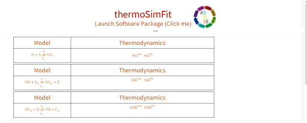
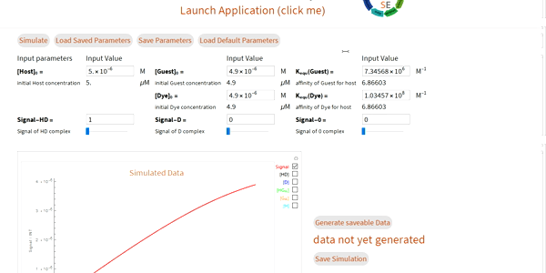
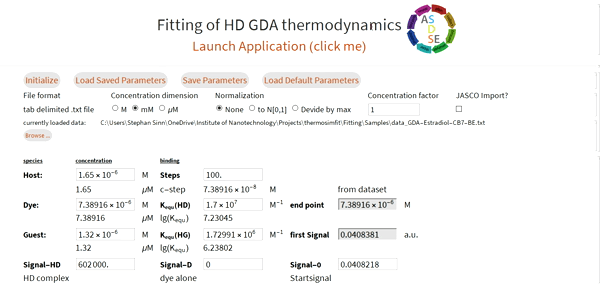

# thermoSimFit

GUI Simulation and Fitting tools for thermodynamic binding isotherms, based on Mathematica.

## Prerequisites

Download and install Mathematica (11/12+) <https://www.wolfram.com/mathematica/>

## Contributions

We are happy for any contributions. ADSDE is the perfect platform for further development and deployment of scientific and educational software. Thus, you are free to fork and dev on your own, or branch and be part of the dev team. Please branch from master.

## How to use

### Download and Installation

1. Download the latest release <https://github.com/ASDSE/thermosimfit/releases>
2. Unpack the zip
3. Open the file **thermoSimFit.nb** (double click)

### Getting started

1. click: **Launch Application**
2. Choose a program of the suite (click on it)
3. click: Launch Application in the open GUI
4. click: **Simulate/Initialize**

### Simulate and Export data (csv format)

1. Fill in the parameters of interest
2. click: **Simulate**; If dynamic evaluation is enable, the simulation is carried out immediately (you don't need to click)
3. click: **Generate saveable Data**
4. click: save data
5. Choose a directory to Save

### Import raw data (txt) and fit to a model

1. click: **Browse...** and choose file -> open
2. select appropriate import parameters (JASCO option recognizes meta data header and footer of the brands output) and click: **Initialize**
3. adjust the values for concentrations and binding constants (CBA) according to acquisition conditions
4. give a good guess for the binding constant of interest and the signal parameters
5. adjust the **red simulated curve** as close as possible to the real data (**blue dots**)
6. click: **Click here to Fit** (choose the fixation wisely)
7. results are presented at the end and can be saved

### Save parameters

In order to reduce frustration, one can save the filled parameters, to use them as a backup if the resulting fit with a lot of unfixed parameters is not well. **Note** The software package comes with pre-saved parameters for the provided real sample data with you can retrieve by simply clicking on **Load parameters**

### Sample data

Sample data for DBA, IDA and GDA is provided in **/Fitting/Samples** (<https://github.com/ASDSE/thermosimfit/tree/master/Fitting/Samples>), results can be found here S Sinn, J Krämer, F Biedermann - Chemical Communications, 2020 <https://doi.org/10.1039/D0CC01841D>

Each sample data has a descriptive name and an info file with the same name providing a good guess. A fit leaving only the binding constant of interest unfixed will give the results presented in the paper.

**Note**: The paper displays the mean of at least (often more repetitions) triplicates of titrations, whereas the sample data provided here is only one part of these repetitions. Thus, the obtained fitting results might differ slightly from the reported ones.
